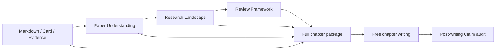
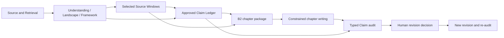

# 文献综述自动化 Pipeline B2 实施分析

_基于现有 B1 代码、14 篇论文真实运行和《B 方案下一阶段改造指南》的实施前分析，2026-07-31。_

---

## 1. 结论

本轮不应直接重写整个 Pipeline。最小且结构正确的实施路径是：

1. 冻结 B1 的代码语义和历史运行；
2. 先实现 B2 的精简章节知识包；
3. 再新增独立的 Claim Ledger 运行；
4. 让 B2 写作同时绑定知识包和已批准 Claim Ledger；
5. 将写后审计升级为“Ledger 一致性 + 来源风险分类”；
6. 最后增加人工修订、重新审计和 A2/B2 公平评价。

Claim Ledger 的正确插入位置是：

```text
Review Framework
→ 精选来源窗口
→ Claim Ledger
→ B2章节知识包
→ 受约束写作
→ B2 Claim审计
```

它不能作为现有写后审计的附属产物，因为其核心价值是限制写作前允许生成的
事实和综合判断。

现有 14 篇 B1 运行证明了改造的必要性：

- 9 章写作 Prompt 共使用 `1,934,876` 个输入 Token；
- Markdown 和 Card 占已统计组件 Token 的约 `83.9%`；
- 同一原文同时通过 Markdown、Card、Evidence 和 Understanding 进入上下文；
- 按 Framework 已选 contribution 回溯时，仅涉及 `210/3220` 个 Card；
- 这些 Card 的正文字符只占所有已装载 Card 正文的约 `8.2%`；
- B1 生成了结构较好的长文，但审计仍发现 11 条核心 unsupported Claim、
  14 条 result type 写大和 14 条 validation level 写大。

因此，B2 的第一目标不是继续扩大上下文，而是让进入上下文的每一层各司其职：

- Framework 决定本章要回答什么；
- Understanding 提供论文级认知；
- Selected Source Windows 提供可回查原文；
- Claim Ledger 决定允许写什么以及能写多强；
- Writing 负责组织语言；
- Audit 检查写作是否忠实执行计划。

## 2. 分析范围和基线

### 2.1 本次检查范围

本分析检查了以下现有模块：

| 阶段 | 主要模块 |
| --- | --- |
| Paper Understanding | `research_understanding.py`、`research_understanding_contracts.py` |
| Research Landscape | `research_landscape.py`、`research_landscape_contracts.py` |
| Review Framework | `review_framework.py`、`review_framework_contracts.py` |
| 章节知识包 | `chapter_knowledge_package.py` |
| 章节写作 | `review_writing.py`、`review_writing_contracts.py` |
| Claim 审计 | `review_claim_audit.py`、`review_claim_audit_contracts.py` |
| CLI | `main.py` |
| 测试 | `tests/test_*understanding*`、`tests/test_research_landscape.py`、`tests/test_review_framework*`、`tests/test_chapter_knowledge_package.py`、`tests/test_review_writing*`、`tests/test_review_claim_audit.py` |

检查的正式运行包括：

| 阶段 | 接受运行 |
| --- | --- |
| Research Landscape | `landscape-14papers-20260730-v9` |
| Review Framework | `framework-14papers-20260730-v2` |
| Chapter Package | `package-framework-v2-writing-v2-section-1..9-20260730` |
| Review Writing | `writing-14papers-20260730-v2` |
| Claim Audit | `claim-audit-14papers-20260730-v12` |
| A/B/C Evaluation | `review-evaluation-abc-14papers-20260730-v4` |

### 2.2 测试基线

从 Python 项目目录 `shipping/` 运行：

```powershell
..\.venv\Scripts\python.exe -m pytest -q tests
```

结果：

```text
442 passed, 73 subtests passed
```

如果从外层 Git 仓库目录直接运行 `pytest shipping/tests`，测试收集会因为
`main.py` 和 `scripts` 不在导入路径中失败。这是当前测试启动目录的既有约束，
不是代码回归。B2 后续验证必须从 Python 项目目录执行。

## 3. B1 当前代码和数据流



### 3.1 Paper Understanding

`PaperUnderstandingRunner` 为每篇论文建立独立不可变运行，冻结：

- normalized Markdown；
- 原始 Card；
- 写作使用的 Card 投影；
- 已有 Evidence；
- 单篇分析输入和输出；
- 模型配置、Prompt、Schema、Token 和失败记录。

正式输出为 `llm.paper_understanding.v1`，目前已经包含 B2 所需的大部分论文级
字段：

- `research_questions`；
- `study_context`；
- `methods`；
- `contributions`；
- `limitations`；
- `review_roles`；
- `unresolved_questions`；
- 来源 `material_ids` 和 `evidence_unit_ids`。

当前不足不是字段太少，而是章节知识包把完整 Understanding 全部展开，没有根据
章节任务投影。

### 3.2 Research Landscape

`ResearchLandscapeRunner` 读取一组明确指定的 Understanding 运行，在跨论文层面
形成：

- 研究维度；
- 论文关系；
- 分歧；
- 时序；
- corpus gaps；
- 语料范围。

Landscape 输出已绑定所有来源 Understanding 运行，适合继续作为 Framework
上游。B2 不需要修改其主流程，但后续 Schema 应明确标记关系的来源性质：

- 论文直接报告；
- 模型推断的互补；
- 模型推断的差异；
- 明确冲突；
- 时序共存；
- corpus gap。

### 3.3 Review Framework

当前 Framework 分两步完成：

1. LLM 生成章节题目、问题、目的、维度、比较任务和语料限制；
2. `derive_review_framework()` 根据 Landscape 确定性派生每章的：
   - `paper_ids`；
   - `contribution_ids`；
   - `citation_keys`；
   - `bibliography_status`；
   - `section_id`。

这一设计是 B2 很好的基础，因为论文和 contribution 选择不是在写作 Prompt 中
临时决定的。

当前缺少：

- Claim 数量预算；
- 允许的综合强度；
- 高风险 Claim 类型；
- 论文材料角色；
- 必选、可选、背景、限制和排除论文的区分；
- 目标字数和段落上限。

### 3.4 Chapter Knowledge Package

`ChapterKnowledgePackageBuilder` 当前对每个 Framework 章节执行以下操作：

1. 重放 Landscape 和 Understanding 来源；
2. 校验 Framework 的论文、贡献和题录绑定；
3. 对每篇相关论文读取完整 Markdown；
4. 读取全部 projected Card；
5. 读取全部 Evidence；
6. 读取完整 Paper Understanding；
7. 读取完整 bibliography；
8. 将以上内容全部写入 `knowledge_package.json`；
9. 用完整包构造写作 Prompt 并计算 Token；
10. 超预算直接失败，不静默截断。

当前每篇论文对象为：

```json
{
  "paper_id": "...",
  "paper_title": "...",
  "source_understanding_run_id": "...",
  "generation_id": "...",
  "citation_key": "...",
  "bibliography": {},
  "understanding": {},
  "full_markdown": "...",
  "cards": [],
  "evidence_units": []
}
```

来源校验、不可变运行、重放和 Token 门禁应保留；需要替换的是正式写作包的内容
投影，而不是删除这些治理能力。

### 3.5 Review Writing

`ReviewWritingRunner` 当前：

- 接收一个 `llm.review_writing_collection.v1`；
- 要求知识包完整覆盖 Framework 所有章节；
- 要求所有知识包绑定同一 Framework、模型和配置；
- 每章调用一次 LLM；
- 输出段落正文和 `citation_keys`；
- 失败时保留部分正文，但不发布正式全文；
- 全章成功后装配 `llm.review_draft.v1`。

当前 `llm.review_chapter.v1` 的段落合同只有：

```json
{
  "paragraph_index": 1,
  "text": "...",
  "citation_keys": ["ref_xxx"]
}
```

它可以限制引用 Key 和机器 ID，却无法证明：

- 段落实现了哪些计划 Claim；
- 正文是否新增了计划外核心事实；
- 引用是否属于对应 Claim；
- 核心 Claim 是否全部实现；
- 结论是否只复用前文已审计 Claim。

### 3.6 Review Claim Audit

当前审计在正文生成后：

1. 按标点将段落拆成句子；
2. 为每个句子生成确定性 `claim_id`；
3. 将完整章节知识包再次交给 LLM；
4. 判断 `factual`、`review_synthesis` 或 `navigation_synthesis`；
5. 输出 `supported`、`qualified`、`unsupported` 或 `not_applicable`；
6. 检查 result type 和 validation level；
7. 核心 unsupported 不为零时阻断发布。

主要限制：

- Claim 是写后拆出的，不是写前批准的；
- “来源存在但缺引用”和“完全无来源”被压缩在同一状态体系中；
- 合理的样本内综合与过度概括区分不足；
- 写作是否偏离计划无法检查；
- 审计 Prompt 再次装载完整知识包；
- 目前只有审计，没有正式 revision 运行。

## 4. 知识包重复来源分析

### 4.1 九章 Token 构成

以下数据直接来自 9 个正式 B1 章节知识包的
`manifest.token_budget.paper_diagnostics`：

| 章节 | 论文数 | Prompt Token | Markdown | Card | Understanding | Evidence | Bibliography |
| ---: | ---: | ---: | ---: | ---: | ---: | ---: | ---: |
| 1 | 14 | 478,793 | 189,359 | 207,995 | 32,324 | 27,389 | 13,802 |
| 2 | 2 | 21,617 | 5,109 | 5,673 | 4,391 | 2,532 | 2,006 |
| 3 | 5 | 54,684 | 15,372 | 13,865 | 11,237 | 6,638 | 4,833 |
| 4 | 5 | 171,955 | 72,211 | 68,249 | 11,163 | 11,908 | 4,675 |
| 5 | 5 | 255,580 | 100,546 | 124,100 | 12,923 | 10,094 | 4,326 |
| 6 | 7 | 204,753 | 80,952 | 78,676 | 16,109 | 17,008 | 7,403 |
| 7 | 3 | 234,058 | 95,782 | 118,759 | 8,047 | 6,266 | 2,369 |
| 8 | 3 | 34,250 | 7,993 | 10,078 | 6,769 | 4,533 | 2,808 |
| 9 | 14 | 479,186 | 189,359 | 207,995 | 32,324 | 27,389 | 13,802 |
| 合计 | 58 次论文装载 | 1,934,876 | 756,683 | 835,390 | 135,287 | 113,757 | 56,024 |

已统计组件合计为 `1,897,141` Token。其构成为：

| 组件 | Token | 组件占比 |
| --- | ---: | ---: |
| 完整 Markdown | 756,683 | 39.9% |
| 全部 Card | 835,390 | 44.0% |
| 完整 Understanding | 135,287 | 7.1% |
| 全部 Evidence | 113,757 | 6.0% |
| 完整 bibliography | 56,024 | 3.0% |

Markdown 与 Card 合计占 `83.9%`。引言和结论分别重新装载全部 14 篇论文，
两章合计使用 `957,979` 个输入 Token，占 9 章写作输入的 `49.5%`。

### 4.2 重复的性质

重复不能只用“完全相同字符串”衡量，当前存在三类重复：

| 类型 | 表现 | B2 处理 |
| --- | --- | --- |
| 逐字重复 | Card extract、Evidence quote 来自 Markdown | Prompt 只展开一个主副本，其余使用 ID |
| 语义重复 | Understanding、Landscape 重述原文和 Card | 按章节投影，只保留承担规划作用的字段 |
| 跨章节重复 | 同一论文在多个章节被完整装载 | 每章只装载相关窗口；结论章不再读全论文 |

Card 与 Markdown 并非每条都能直接做字符串包含判断，因为制卡过程进行了标题、
空白、标点和 OCR 清理。因此实现中应记录来源坐标和规范化指纹，不能用模糊文本
匹配替代来源绑定。

### 4.3 精选窗口规模估计

现有 Framework 已为每章选定 `contribution_ids`。将这些 contribution 的
`material_ids` 回溯到 Card，可得到一个保守的第一轮窗口候选集：

| 章节 | 全部 Card | contribution 命中 Card | 全部 extract 字符 | 命中 extract 字符 | 命中比例 |
| ---: | ---: | ---: | ---: | ---: | ---: |
| 1 | 804 | 60 | 209,929 | 19,096 | 9.1% |
| 2 | 24 | 4 | 5,765 | 2,010 | 34.9% |
| 3 | 71 | 13 | 13,066 | 3,753 | 28.7% |
| 4 | 229 | 12 | 75,355 | 4,475 | 5.9% |
| 5 | 491 | 17 | 119,293 | 6,312 | 5.3% |
| 6 | 281 | 22 | 86,270 | 6,762 | 7.8% |
| 7 | 466 | 13 | 113,874 | 5,178 | 4.5% |
| 8 | 50 | 9 | 9,643 | 2,303 | 23.9% |
| 9 | 804 | 60 | 209,929 | 19,096 | 9.1% |
| 合计 | 3,220 | 210 | 843,124 | 68,985 | 8.2% |

这不是最终 Selected Source Windows 数量，因为关键结果还需要扩展相邻方法、
结果和限制上下文。但它证明“全部 Card 进入写作”不是必要条件。

按章节 contribution 对 Understanding 做字段和来源交集投影后，序列化字符量约为
原完整 Understanding 的 `50.4%`。这一数字同样只用于实施估计，不是正式 Token
验收结果。

## 5. B2 目标数据流



### 5.1 规划与写作的边界

Claim Ledger 生成阶段允许使用：

- Framework section；
- 章节相关 Understanding 投影；
- Selected Source Windows；
- Landscape 中与本节直接相关的关系、分歧和 corpus gap；
- citation metadata。

写作阶段只使用：

- Section Task；
- Approved Claim Ledger；
- Ledger 实际引用的 Source Windows；
- 必要的 Understanding 投影；
- citation metadata；
- 写作配置。

审计阶段使用：

- 正文；
- Approved Claim Ledger；
- Ledger 绑定的来源窗口；
- 必要时按 ID 回查后台 Card、Evidence 或 Markdown。

这三个阶段不能共用一个无限扩张的“全量知识包”。

## 6. Claim Ledger 插入点

### 6.1 运行级位置

新增运行：

```text
workspace/_claim_ledgers/runs/<run_id>/
```

它显式绑定：

- `framework_run_id`；
- `section_id`；
- `source_window_run_id`；
- `model_profile_sha256`；
- `claim_ledger_config_sha256`。

知识包 B2 随后绑定：

- `framework_run_id`；
- `source_window_run_id`；
- `claim_ledger_run_id`。

写作运行不允许自行寻找“最新 Ledger”，必须由 collection 显式列出每章的包和
Ledger，或者由 B2 package manifest 唯一绑定。

### 6.2 生成与批准

第一版采用“模型生成候选 + 程序确定性校验 + 自动批准通过项”的方式：

1. LLM 生成候选 Claim；
2. 程序验证论文、窗口和 citation key；
3. 程序验证 Claim 类型的结构规则；
4. 程序计算确定性 `claim_id`；
5. 通过项进入 `approved_claims.jsonl`；
6. 不通过项进入 `rejected_claims.jsonl`；
7. 任一核心候选被拒绝时，该章节 Ledger 运行失败。

此阶段不加入人工逐条审批。后续人工控制集中在审计后的风险修订，避免在每篇论文
和每章生成前制造大规模人工负担。

### 6.3 Claim ID

`claim_id` 不依赖批次号和模型返回顺序，建议基于以下规范化对象生成：

```json
{
  "schema_version": "llm.claim_ledger_claim.v1",
  "framework_id": "...",
  "section_id": "...",
  "claim_type": "...",
  "planned_claim": "...",
  "supporting_papers": [],
  "supporting_source_windows": [],
  "allowed_strength": "..."
}
```

修改 Claim 文本、来源或允许强度时生成新 ID，不覆盖旧 Claim。

## 7. Schema 设计

### 7.1 Framework v2

保留 v1 字段，新增每章：

```json
{
  "target_chars": 900,
  "max_paragraphs": 5,
  "claim_budget": {
    "core_max": 4,
    "supporting_max": 8,
    "cross_paper_synthesis_max": 2
  },
  "material_selection": {
    "required_paper_ids": [],
    "optional_paper_ids": [],
    "background_only_paper_ids": [],
    "limitation_only_paper_ids": [],
    "excluded_paper_ids": []
  },
  "high_risk_claim_types": [],
  "conclusion_strength_limit": "targeted_corpus_only"
}
```

约束：

- 五类论文集合互斥；
- `required_paper_ids` 必须是现有派生 `paper_ids` 的子集；
- body 章节必须有正数 Claim 预算；
- introduction 和 conclusion 使用不同默认预算；
- `target_chars` 总和必须落在综述目标字数区间；
- 排除论文不得出现在后续窗口和 Ledger。

### 7.2 Selected Source Window v1

新增：

```json
{
  "schema_version": "llm.selected_source_window.v1",
  "window_id": "window_...",
  "section_id": "section_...",
  "paper_id": "...",
  "citation_key": "ref_...",
  "window_type": "result_context",
  "text": "...",
  "heading_path": [],
  "source_spans": [],
  "material_ids": [],
  "contribution_ids": [],
  "result_type": "simulation_result",
  "validation_level": "simulation",
  "contains_limitation": false,
  "parse_flags": [],
  "quality_flags": [],
  "selection_reason": "..."
}
```

`window_type` 第一版固定为：

```text
problem_context
method_context
result_context
limitation_context
author_conclusion
implementation_status
```

约束：

- `source_spans` 必须能回查冻结 Markdown；
- `material_ids` 必须属于同一论文；
- `citation_key` 必须与 Framework 题录一致；
- 同一规范化文本只展开一次；
- 相邻窗口可确定性合并，但不能跨论文合并；
- 未闭合来源、越界坐标和空文本直接失败。

### 7.3 Relevant Understanding Projection v1

不修改历史 `llm.paper_understanding.v1`，新增章节投影对象：

```json
{
  "paper_id": "...",
  "paper_title": "...",
  "paper_relevance": "core",
  "research_questions": [],
  "study_context": {},
  "methods": [],
  "contributions": [],
  "limitations": [],
  "review_roles": []
}
```

投影只能从冻结 Understanding 确定性派生。第一版按本节
`contribution_ids`、来源交集和材料角色选择，不调用 LLM 二次摘要。

### 7.4 Claim Ledger v1

核心 Claim 对象：

```json
{
  "claim_id": "claim_...",
  "section_id": "section_...",
  "claim_type": "cross_paper_synthesis",
  "planned_claim": "...",
  "section_role": "topic_sentence",
  "importance": "core",
  "supporting_papers": [],
  "supporting_source_windows": [],
  "citation_keys": [],
  "support_mode": "corpus_level_inference",
  "result_type": "mixed",
  "validation_level": "mixed",
  "allowed_strength": "targeted_corpus_only",
  "required_qualifier": "本次纳入的文献显示",
  "prohibited_phrasings": [],
  "audit_notes": ""
}
```

Claim 类型：

```text
direct_fact
comparative_fact
cross_paper_synthesis
author_view_summary
corpus_gap
normative_recommendation
navigation_synthesis
```

程序硬约束：

- `direct_fact` 至少一个来源窗口；
- `comparative_fact` 至少两篇论文且所有比较对象有窗口；
- `cross_paper_synthesis` 至少两篇独立论文；
- `corpus_gap` 必须使用样本范围限定；
- `author_view_summary` 不得使用工程事实强度；
- `normative_recommendation` 必须与论文报告事实分离；
- Claim 中提到的论文必须进入本章材料集合；
- citation key 集合必须与 supporting papers 一一对应；
- result type 和 validation level 必须属于显式枚举；
- 禁止措辞命中时不得批准。

### 7.5 B2 chapter package v2

正式写作包改为：

```json
{
  "schema_version": "llm.chapter_knowledge_package.v2",
  "source": {},
  "section_task": {},
  "material_tier": "tier_1",
  "understanding_projections": [],
  "selected_source_windows": [],
  "citation_metadata": [],
  "approved_claim_ledger": {},
  "context_composition": {},
  "package_id": "package_..."
}
```

完整 Markdown、全部 Card、全部 Evidence 继续冻结在运行输入目录和来源运行中，
但不进入 `output/knowledge_package.json` 和写作 Prompt。

### 7.6 Review writing v2

段落 Schema 新增：

```json
{
  "paragraph_index": 1,
  "text": "...",
  "implemented_claim_ids": [],
  "citation_keys": []
}
```

程序校验：

- 每个 Claim ID 必须来自本章 Approved Ledger；
- 段落 citation keys 必须是 implemented Claims 所允许引用的子集；
- 每个核心 Claim 必须恰好由至少一个段落实质实现；
- 每段核心 Claim 数不得超过配置；
- 正文不能出现机器 ID；
- 未实现核心 Claim 直接失败；
- 重复实现允许记录，但超过阈值产生质量错误。

`review_draft.v2` 还应保存 Claim 到段落的反向索引，供审计和人工修订使用。

### 7.7 Conclusion chapter v1

结论章使用独立输入合同：

```text
前文已审计核心Claim
+ Approved multi-paper synthesis
+ corpus gap
+ normative recommendation
```

它不读取全部论文 Markdown、Card 和 Evidence，也不能重新提出未在 Ledger 中
出现的高层事实。

结论 Claim 类型限制为：

```text
direct_summary
multi_paper_synthesis
corpus_gap
normative_recommendation
```

### 7.8 Claim audit v4

将单一 `status` 扩展为风险分类：

```text
supported
qualified
missing_citation_binding
unsupported_inference
overgeneralized_synthesis
result_type_overstatement
validation_level_overstatement
source_mismatch
contradicted
unsupported_fact
unplanned_claim
```

每条审计记录同时保存：

- `planned_claim_ids`；
- `risk_categories`；
- `source_assessments`；
- `recommended_actions`；
- `blocking`；
- `human_confirmation_required`。

发布门禁由程序根据风险分类和 importance 计算，LLM 不直接决定
`publishable`。

### 7.9 Revision v1

人工修订决策：

```json
{
  "revision_decision_id": "decision_...",
  "audit_run_id": "...",
  "claim_id": "...",
  "action": "downgrade",
  "selected_suggestion_index": 2,
  "replacement_text": "...",
  "decided_by": "human",
  "reason": "..."
}
```

允许动作：

```text
add_citation
downgrade
delete
split
convert_to_corpus_synthesis
convert_to_author_view
convert_to_normative_recommendation
keep_with_human_confirmation
```

程序创建新的 revision 运行和新正文，不覆盖原写作运行。

## 8. 模块修改清单

### 8.1 新增模块

| 模块 | 职责 |
| --- | --- |
| `source_window_contracts.py` | Source Window Schema、枚举和确定性校验 |
| `source_window_selection.py` | 从 Framework、Understanding、Card 和 Markdown 装配窗口 |
| `source_window_report.py` | 窗口覆盖、去重、来源和 Token 报告 |
| `claim_ledger_contracts.py` | Ledger Schema、类型和批准规则 |
| `claim_ledger.py` | 候选生成、来源校验、批准/拒绝和运行管理 |
| `claim_ledger_report.py` | 人工可读 Claim 计划与拒绝原因 |
| `review_revision_contracts.py` | 人工决策和 revision Schema |
| `review_revision.py` | 应用决策、生成 diff、新 revision 和重审绑定 |
| `review_revision_report.py` | 原文、修改、原因和审计状态报告 |

### 8.2 修改模块

| 模块 | 修改 |
| --- | --- |
| `review_framework_contracts.py` | 增加 Claim 预算、材料角色、目标字数和强度上限 |
| `review_framework.py` | 使用 v2 Schema，并冻结新增配置 |
| `chapter_knowledge_package.py` | 支持 v2 包、material tier、窗口、投影、Ledger 和组成报告 |
| `review_writing_contracts.py` | 增加 implemented Claim、覆盖率和 citation 一致性 |
| `review_writing.py` | 绑定 Ledger、结论独立 Prompt、生成 B2 draft |
| `review_claim_audit_contracts.py` | 扩展风险类型、建议动作和发布门禁输入 |
| `review_claim_audit.py` | 检查 Ledger 差异、按需回查来源并输出 v4 审计 |
| `review_claim_audit_report.py` | 按风险类型和修订动作展示 |
| `main.py` | 增加窗口、Ledger、B2 package、revision CLI |

### 8.3 CLI

建议新增：

```text
source-window-selection
llm-claim-ledger
chapter-knowledge-package-b2
llm-review-writing-b2
llm-review-claim-audit-b2
review-revision
```

第一版保留显式 B2 命令，不复用原命令名，避免误读历史 v1 产物。B2 稳定后再考虑
统一命令和 `--pipeline-version`。

## 9. 运行目录和 manifest

### 9.1 新运行目录

```text
workspace/
  _source_windows/runs/<run_id>/
  _claim_ledgers/runs/<run_id>/
  _chapter_knowledge_packages_b2/runs/<run_id>/
  _review_writings_b2/runs/<run_id>/
  _review_claim_audits_b2/runs/<run_id>/
  _review_revisions/runs/<run_id>/
```

暂时使用独立根目录，而不是在现有目录混放 v1/v2。这样可以使 loader 简单拒绝
错误代际，降低历史运行被新代码误解释的风险。

### 9.2 每个 manifest 的共同字段

```text
schema_version
run_id
pipeline_generation
status
started_at
finished_at
upstream_run_ids
input_sha256
model_profile_id
model_profile_sha256
config_sha256
prompt_sha256
output_sha256
usage
failure
artifacts
```

此外：

- Source Window manifest 记录窗口覆盖、去重和 material tier；
- Ledger manifest 记录候选、批准、拒绝和核心 Claim 完整性；
- Package manifest 记录各组件 Token、重复率和 Ledger 绑定；
- Writing manifest 记录 Claim 覆盖、计划外 Claim 初筛和目标篇幅；
- Audit manifest 记录各风险类别和程序发布门禁；
- Revision manifest 记录原审计、人工决策、新正文和后续审计。

### 9.3 失败状态

继续遵循：

- 运行目录一旦建立不可覆盖；
- 失败保留 manifest、失败账本和已产生的原始响应；
- 下游只接受 `status=completed` 且 Schema 版本匹配的运行；
- 不查找“最近成功运行”作为隐式兜底；
- 不修改旧运行使其看起来通过；
- API 分章失败可以续跑，但新运行必须显式绑定续跑来源。

## 10. B1 历史兼容策略

### 10.1 保留内容

以下内容保持只读：

- 所有 `llm.*.v1`、现有 audit v3 合同；
- B1 运行根目录；
- 14 篇正式运行；
- A/B/C v4 评价；
- 现有 UI 所使用的旧流程；
- 原 CLI 行为。

### 10.2 不做兼容转换

不实现以下行为：

- 将 B1 package 自动升级为 B2 package；
- 为 B1 正文补造 Claim Ledger；
- 用 B1 写后 Claim 反推“计划 Claim”；
- 让 B2 loader 接受缺失字段的旧对象；
- 修改历史 JSON 添加新字段。

原因是 B1 没有写前 Claim 计划，任何补造都会伪造运行语义。

### 10.3 可复用上游

B2 可以显式读取已完成的：

- Paper Understanding v1；
- Research Landscape v1；
- Review Framework v1。

第一阶段通过 Framework v1 的 `contribution_ids` 构建窗口，用于验证精简逻辑。
进入 Claim Ledger 正式生成前，应生成 Framework v2，以获得 Claim 预算和材料选择
规则。

## 11. 分阶段实施计划

### 11.1 Phase 0：冻结基线

实施：

- 使用独立 Git 分支 `codex/b2-review-pipeline`；
- 保留现有 B1 运行；
- 记录完整测试基线；
- 不修改现有 UI；
- 不发送外部 API 请求。

测试：

- 完整测试套件；
- Git 状态检查；
- B1 manifest 和正式报告可读取。

验收：

- `442 passed, 73 subtests passed`；
- 现有 B1 产物未改变；
- B2 开发不在旧分支直接进行。

状态：已完成。

### 11.2 Phase 1：知识包精简

实施顺序：

1. 定义 Source Window Schema；
2. 实现 contribution 到 material 的确定性回溯；
3. 根据 heading 和相邻来源坐标扩展方法、结果、限制上下文；
4. 实现窗口去重和稳定 ID；
5. 实现 Understanding 章节投影；
6. 实现 Tier 1 包；
7. 加入显式 Tier 2；
8. Tier 3 仅用于基线命令；
9. 输出 Token、覆盖和去重报告。

测试：

- contribution material 全部被窗口覆盖；
- window source span 可在冻结 Markdown 重放；
- 不允许跨论文窗口；
- 同文同坐标合并结果稳定；
- Tier 不得隐式升级；
- 超预算明确失败；
- B1 loader 拒绝 v2，B2 loader 拒绝 v1；
- 14 篇 9 章离线重建。

验收：

- 所有 Framework contribution 均能回查至少一个窗口；
- 方法、结果和限制三类上下文没有因去重丢失；
- 写作包不包含 `full_markdown`、全部 `cards`、全部 `evidence_units`；
- Prompt Token 相比 B1 显著下降；
- 无静默截断；
- 全部测试通过。

### 11.3 Phase 2：Claim Ledger

实施顺序：

1. 定义 v1 Schema 和配置；
2. 建立候选生成 Prompt；
3. 实现确定性 ID；
4. 实现程序来源校验；
5. 实现强度、限定语和禁止措辞校验；
6. 输出 approved/rejected；
7. 生成人工可读报告；
8. 用 14 篇 9 章真实调用验证。

测试：

- direct fact 无窗口时拒绝；
- cross-paper synthesis 少于两篇时拒绝；
- corpus gap 无范围限定时拒绝；
- citation 与论文不匹配时拒绝；
- 未入选论文被点名时拒绝；
- 重排候选不改变 Claim ID；
- 任一核心 Claim 被拒绝时运行失败；
- API 原始响应和 Token 完整保存。

验收：

- 核心 Claim 来源绑定率 100%；
- 核心 cross-paper synthesis 均绑定至少两篇论文；
- corpus gap 范围限定率 100%；
- 所有批准 Claim 的允许强度字段完整；
- 拒绝项不会进入 B2 package。

### 11.4 Phase 3：受约束写作和结论章

实施顺序：

1. 增加 `implemented_claim_ids`；
2. 校验 Claim 与 citation 的集合关系；
3. 增加核心 Claim 覆盖；
4. 加入目标字数、段落数和 Claim 密度；
5. 增加计划外 Claim 初筛；
6. 建立独立结论输入合同和 Prompt；
7. 生成 B2 draft v2。

测试：

- 未知 Claim ID 拒绝；
- 引用超出 Claim 允许集合拒绝；
- 核心 Claim 未实现拒绝；
- 正文机器 ID 拒绝；
- conclusion 读取原论文时拒绝；
- conclusion 新增高层事实时进入 unplanned；
- 部分章节失败不发布正式全文。

验收：

- 核心 Claim 实现率至少 95%，未实现项明确报告；
- 核心 unplanned factual Claim 为 0；
- 引用均能映射到 Ledger；
- 正文机器 ID 为 0；
- 总正文控制在 7,000 至 9,000 个中文字符附近。

### 11.5 Phase 4：审计分类

实施顺序：

1. 扩展 v4 风险类型；
2. 同时对照正文、Ledger 和来源窗口；
3. 区分缺引、来源错配、过度综合和无来源事实；
4. 程序计算阻断状态；
5. 输出有限修订建议；
6. 建立人工金标准文件格式。

测试：

- 每种风险类型至少一个正例和反例；
- 计划外 Claim 能从 Ledger 差异识别；
- `publishable` 不接受模型直接输入；
- blocking 风险未修复时始终拒绝；
- 建议动作与风险类型兼容。

验收：

- 核心 unsupported fact、contradicted、source mismatch 和 unplanned
  均为强制阻断；
- result type 和 validation level 写大均阻断；
- 缺引用与无来源事实分开统计；
- 人工报告能直接看到正文、计划 Claim、来源窗口和建议动作。

### 11.6 Phase 5：人工修订与重新审计

实施顺序：

1. 定义修订决策文件；
2. 生成每条风险最多三种建议；
3. 接受人工选定动作；
4. 程序生成差异；
5. 创建不可变 revision；
6. 强制创建新的 audit 运行；
7. 比较修订前后风险。

测试：

- 修改原文运行被拒绝；
- 未绑定 audit 的决策被拒绝；
- 替换范围与 Claim 不一致时拒绝；
- revision 后未重审不能发布；
- 连续 revision 保持祖先链；
- 原文、修改和原因均可回查。

验收：

- 人工无需手工查找机器 ID 即可判断；
- 每项变更有 diff、原因和决策人；
- 新正文不覆盖旧正文；
- 重审结果显式绑定 revision。

### 11.7 Phase 6：A2/B2 公平评价

实施：

- 同一 14 篇论文；
- 同一题目；
- 同一 Framework v2；
- 同一 7,000 至 9,000 字目标；
- 同一模型、参数、引用格式和审计器；
- A2 不使用 Understanding、Landscape 和 Ledger；
- B2 使用精简包和 Ledger；
- 记录真实人工编辑时间和修改字符比例。

验收试验值：

- B2 核心事实支持率不低于 A2 超过 5 个百分点；
- 核心 unsupported fact 为 0；
- 核心 source mismatch 为 0；
- 结构和比较评分至少 4/5；
- 人工修改字符比例不超过 20%；
- Token 成本不超过 A2 的 3 倍。

Phase 6 完成前不决定 B2 是否进入默认 Pipeline 或 UI。

## 12. Token 变化估计

### 12.1 已知基线

B1 章节写作：

```text
9章输入 Token：1,934,876
9章输出 Token：16,109
写作合计 Token：1,950,985
```

B1 Claim 审计：

```text
输入 Token：1,990,000
输出 Token：63,385
审计合计 Token：2,053,385
```

写作和审计两阶段合计约 `4,004,370` Token，尚不包含上游 Understanding、
Landscape 和 Framework。

### 12.2 B2 静态估计

如果：

- 删除写作 Prompt 中完整 Markdown；
- 不展开全部 Card；
- 不展开全部 Evidence；
- Understanding 投影约保留 50%；
- Selected Source Windows 扩展到 contribution 直接命中正文的 1.5 至 2.5 倍；
- 结论章只读取已审计核心 Claim；
- 加入 Claim Ledger 和必要元数据；

则 9 章写作输入的初步目标范围为：

```text
约 250,000 至 450,000 Token
```

相对 B1 写作输入预计下降约：

```text
77% 至 87%
```

这是架构估计，不是验收事实。Phase 1 必须使用真实 tokenizer 对 9 章逐章重算。

Claim Ledger 会新增一轮 LLM 输入，因此 B2 的端到端成本不能只看写作阶段。
第一轮合理目标是：

```text
Claim规划 + B2写作的输入Token
低于B1写作单阶段的1,934,876 Token
```

审计阶段也应只读取 Ledger 和相关窗口，目标是明显低于 B1 的
`1,990,000` 输入 Token。最终成本结论必须通过 A2/B2 实际运行得出。

## 13. 主要风险

### 13.1 窗口过窄导致上下文失真

风险：

- 只取结果句，缺少方法和限制；
- Card 跨句清理后无法表达原文语境；
- OCR 问题在短窗口中更难识别。

控制：

- 关键结果强制关联 method/result/limitation 窗口；
- 使用原始 Markdown 坐标扩展相邻上下文；
- 保留 parse 和 quality flags；
- 不足时显式要求 Tier 2，而不是静默升级。

### 13.2 Claim Ledger 把写作约束得过死

风险：

- 正文变成 Claim 列表拼接；
- 转折和解释被误判为计划外内容；
- 合理综合因类型约束被拒绝。

控制：

- `navigation_synthesis` 允许无事实新增的组织语言；
- `cross_paper_synthesis` 允许样本内综合；
- 只阻断计划外核心事实，不阻断纯语言连接；
- 在真实章节中观察逐篇复述比例和可读性。

### 13.3 Claim 粒度不稳定

风险：

- 一条 Claim 同时包含多个事实；
- 一段实现多个 Claim 时映射模糊；
- 写后拆句与写前 Claim 不能一一对应。

控制：

- Ledger Schema 限制每条 Claim 的事实中心；
- 每段核心 Claim 数设上限；
- 审计保留“计划 Claim”和“正文 Claim”两套 ID；
- 使用多对多映射，不强求一一对应。

### 13.4 程序规则无法判断语义强度

风险：

- `allowed_strength` 和实际措辞仍需语义判断；
- 禁止词列表无法覆盖隐性写大。

控制：

- 程序负责来源、数量、身份和枚举；
- LLM 负责语义强度和结果类型判断；
- 两者结果分别记录；
- 高风险综合保留人工确认。

### 13.5 新旧代际混用

风险：

- v1 package 被 v2 writer 误读；
- B2 audit 读取 B1 draft 并假定存在 Ledger；
- 用户误把历史结果当新结果。

控制：

- 新 Schema 版本；
- 新运行根目录；
- 独立 CLI；
- loader 严格检查代际；
- manifest 显式 `pipeline_generation`。

### 13.6 14 篇验证不能代表更大语料

风险：

- 论文数增加后 Ledger 和窗口仍可能超预算；
- 同一章节绑定论文过多；
- Framework 维度过粗导致窗口选择膨胀。

控制：

- 先完成 14 篇全链路；
- 记录每章论文数、窗口数、Claim 数和 Token；
- 出现真实超预算样本后再设计分层 Ledger；
- 不提前加入静默删除或摘要兜底。

## 14. 回滚方式

B2 每个阶段都通过新增目录和 Schema 实现，因此回滚不是修改或删除历史文件，而是：

1. 停止创建下一阶段 B2 运行；
2. 保留失败运行和报告；
3. 将当前 B2 分支回退到上一通过阶段的提交；
4. B1 代码、运行和 UI 继续可用；
5. 不把 B2 产物转换为 B1 产物；
6. 不删除已经产生的失败记录。

阶段回滚边界：

| 阶段 | 可独立回滚到 |
| --- | --- |
| Source Windows | B1 package builder |
| Claim Ledger | 已验证的 B2 Source Windows |
| B2 Writing | 已验证的 Ledger 和 B2 package |
| B2 Audit | 已验证的 B2 draft |
| Revision | 已验证的 B2 audit |
| A2/B2 Evaluation | 两套冻结的写作与审计运行 |

## 15. 当前不需要用户决定的问题

以下事项可以按本分析直接实施：

- B1 保持只读；
- B2 使用独立分支、Schema、CLI 和运行根目录；
- 第一开发阶段只做 Source Windows 和精简知识包；
- Tier 1 为默认，Tier 2 和 Tier 3 必须显式指定；
- 第一版 Understanding 投影采用程序派生，不新增 LLM 摘要；
- 第一版 Claim Ledger 自动批准程序校验通过项；
- B2 通过真实实验前不接 UI；
- 不修改历史 JSON，不补造旧 Ledger。

## 16. 后续需要用户验收的节点

第一个用户验收点应放在 Phase 1 完成后。届时提供：

1. 9 章 B1/B2 知识包内容对照；
2. 每章 Token 降幅；
3. 每个 contribution 的窗口覆盖；
4. 方法、结果和限制上下文是否保留；
5. Tier 使用记录；
6. 去重报告；
7. 14 篇离线重放结果；
8. 完整测试结果。

只有 Phase 1 证明“显著减重且没有静默丢失关键上下文”后，才开始外部
DeepSeek Claim Ledger 调用。

## 17. 建议的下一动作

下一动作是实施 Phase 1，范围限定为：

```text
Source Window合同
→ 确定性窗口选择
→ Understanding章节投影
→ B2精简知识包
→ Token与去重报告
→ 14篇9章离线验证
```

本阶段不修改写作、不调用 LLM、不修改审计、不接 UI。这样可以先验证 B2 最重要
的前提：在保留来源可回查和章节任务所需语境的同时，能否真正去掉 B1 中的大量
重复上下文。
