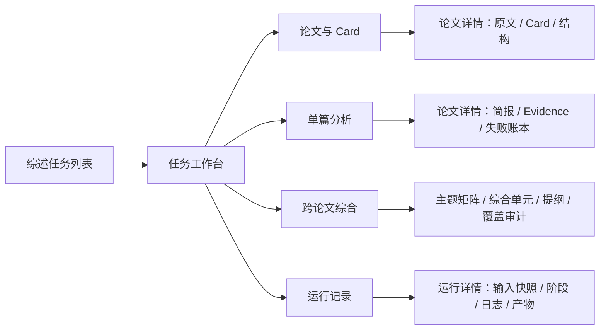
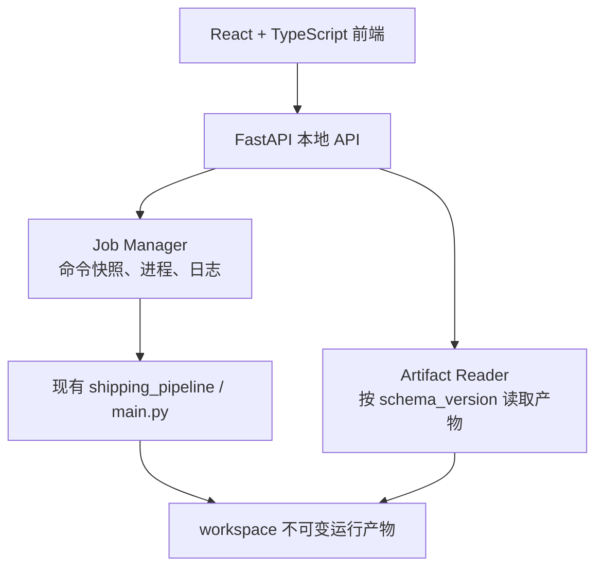

# 文献综述 Pipeline 可视化工作台 v1 设计

日期：2026-07-28

## 1. 产品定位

界面定位为本地“综述工作台”，服务于当前已有的三阶段 pipeline：

1. PDF/Markdown → MinerU Markdown → Card。
2. 单篇 Card → 主题简报与 Evidence。
3. 多篇单篇简报 → 主题矩阵与综述提纲。

界面负责管理论文、选择输入代际、发起运行、展示进度和阅读审计结果。解析、证据合同、
覆盖校验和失败判定继续由现有 Python pipeline 负责。

v1 不承担：

- 不在前端修补模型 JSON。
- 不要求人工逐条裁决 Card 或 Evidence。
- 不自动越过失败屏障。
- 不自动把三个阶段连续执行；每个阶段默认独立启动。
- 不生成最终综述正文。

## 2. 核心设计原则

### 2.1 以综述任务为组织单位

一个综述任务对应一个主题和一组论文。用户进入任务后，应首先看到所有论文在三个阶段中的
状态，而不是运行目录或 JSON 文件。

### 2.2 以原文位置为审核主轴

人工阅读时不要求用户查找 `material_id` 或 `evidence_unit_id`。论文详情以带行号的
`normalized/document.md` 为主视图，Card、Evidence 和失败记录根据 `source_span`
自动定位并高亮原文。

ID 只在“高级审计”中展示和复制。

### 2.3 部分完成不是完全成功

单篇分析必须区分：

| 程序状态 | 中文显示 | 界面含义 |
|---|---|---|
| `completed` | 已完成 | 基础分析和自动回查均闭合 |
| `completed_with_failures` | 部分 Evidence 失败 | 有效 Evidence 可用，部分入选 Card 已进入失败账本 |
| `completed_with_revisit_failure` | 回查未闭合 | 基础简报有效，自动回查没有完成 |
| `excluded` | 与主题无关 | 合法结果，不进入综合 |
| `failed` | 失败 | 不得进入综合 |

表格、筛选器和详情页使用相同状态名称。不得把前三种状态统一显示成“成功”。

### 2.4 所有运行输入显式冻结

点击运行前显示本次将使用的：

- 综述主题；
- 论文清单；
- Card generation；
- 单篇分析 run ID；
- 模型 profile 和配置文件；
- 将发送给外部服务的论文数量及 Card 数量。

确认后生成不可变 collection 快照。后续修改论文或主题会产生新版本，不改写历史运行。

## 3. 信息架构



### 3.1 全局导航

左侧固定导航：

- 综述任务
- 全部论文
- 运行记录
- 系统状态

顶部只显示当前任务名称、主题和任务切换器。API Key 不在界面中显示，只显示
“已配置/未配置”和连接测试结果。

### 3.2 任务工作台

任务页采用紧凑表格，不使用卡片瀑布：

```text
┌──────────────────────────────────────────────────────────────────────────┐
│ 三峡枢纽通航能力、调度优化与碍断航风险        8篇论文   最近运行 10:36 │
├──────────────────────────────────────────────────────────────────────────┤
│ [论文与Card 8/8] [单篇分析 8/8] [跨论文综合 已完成]      [运行下一阶段] │
├──────────────────────────────────────────────────────────────────────────┤
│ 搜索论文...   Card状态▼  分析状态▼  相关性▼                  导入论文 │
├──────────────────────────────────────────────────────────────────────────┤
│ 论文                 Card       结构    单篇分析       Evidence  问题  │
│ 三峡船闸运行评价...   35 已完成   silver  部分失败       3         1    │
│ 翻坝线路优选模型...   19 已完成   silver  部分失败       1         3    │
│ 元胞自动机...        295 已完成   silver  回查未闭合     6         1    │
└──────────────────────────────────────────────────────────────────────────┘
```

阶段按钮行为：

- `运行 PDF→Card`：仅处理选中来源，不触发 LLM。
- `运行单篇分析`：仅允许选择有当前 Card generation 的论文。
- `运行跨论文综合`：显式选择可用单篇 run，不隐式选择“最新”。
- `运行完整流程`：保留为次级菜单，使用现有 `full-pipeline`，不作为默认动作。

## 4. 页面设计

### 4.1 综述任务列表

每行显示：

- 任务名称与主题；
- 论文总数；
- Card 完成/失败数；
- 单篇分析各状态数量；
- 最近一次综合状态；
- 最近更新时间。

主操作是“打开任务”。“新建任务”进入两步表单：

1. 填写任务名称和综述主题。
2. 拖入 PDF/Markdown，检查或修改稳定 `paper_id`。

导入文件复制到任务的 `sources/` 目录并记录 SHA-256。相同哈希在同一任务中直接拒绝，
不自动创建重复论文。

### 4.2 论文与 Card

列表支持按状态、结构质量、Card 数量和问题码筛选。点击论文进入详情页。

论文详情采用双栏：

```text
┌───────────────────────────────┬──────────────────────────────────────────┐
│ 原始 Markdown                 │ Card / Evidence / 失败 / 结构            │
│ 127  ...                      │ 标题：3 算例                             │
│ 128  需要说明的是...  █████   │ 来源：L128-L135                         │
│ 129  路线选择除了...  █████   │ 类型：prose                             │
│ 130  ...                      │ 质量标记：clean.removed_markup          │
│ 131  ...              █████   │ [上一项] [下一项] [在原文定位]          │
└───────────────────────────────┴──────────────────────────────────────────┘
```

右侧标签：

- `Card`：标题、完整 extract、heading path、质量标记。
- `Evidence`：claim、逐字引文、相关性、置信度、限制。
- `失败`：错误码、中文错误、失败 Card 完整内容。
- `结构`：文档范围、结构质量、问题码、三层覆盖。

默认隐藏长 ID、路径和原始响应；“高级审计”抽屉按需展示。

### 4.3 单篇分析

任务级分析页是一张论文表，突出“是否足够服务综述主题”：

- 论文相关性：core/supporting/peripheral/excluded；
- 来源 Card、入选 Card、回查 Card；
- 有效 Evidence 数；
- Evidence 失败数；
- Token 和请求数；
- 当前 run ID 和 Card generation。

点击一篇论文时，右侧打开简报：

1. 论文定位。
2. 与综述主题的关系。
3. 主要研究点。
4. Evidence 列表。
5. 回头看结果。
6. 失败 Card 账本。

`completed_with_failures` 不弹出人工裁决任务。用户可以直接接受有效 Evidence，
或者显式点击“用同一 generation 重新分析”。

### 4.4 跨论文综合

页面使用四个标签：

- `主题矩阵`
- `综合单元`
- `章节提纲`
- `覆盖审计`

主题矩阵以主题为行、论文为列。单元格显示 Evidence 数量；点击后在下方列出 claim、
逐字引文和原文定位。

章节提纲按实际章节和段落顺序展示，不显示模型 JSON。每个综合单元旁显示：

- 涉及论文数；
- Evidence 数；
- 关系类型；
- 对应主题；
- 是否已进入提纲。

覆盖审计固定展示：

- 来源 Evidence；
- 单主题/多主题 Evidence；
- 未归组 Evidence；
- 已归组但未进入提纲 Evidence；
- 未入纲综合单元；
- 未优先缺口；
- 部分状态论文。

所有非零遗漏项均可展开查看具体内容，不只显示数量或 ID。

### 4.5 运行记录

运行列表不混合不同层级，支持按阶段筛选：

- PDF→Card
- 单篇分析
- 跨论文综合
- 完整流程

运行详情显示：

- 输入快照及 SHA-256；
- 每阶段开始/结束时间；
- 当前状态和失败码；
- 模型、请求数、Token；
- stdout/stderr 实时日志；
- 产物链接；
- 子运行关系。

历史运行只读。重跑会创建新 run ID，并在新运行中记录来源运行，不覆盖旧目录。

## 5. 运行交互

### 5.1 运行前检查

运行按钮打开侧边确认面板：

1. 输入范围。
2. 代际与 run ID。
3. 配置和模型。
4. 外部数据发送范围。
5. 预计执行阶段。

调用 DeepSeek 或 MinerU 时必须明确显示外部服务名称。界面不显示 Key 值。

### 5.2 运行中

顶部显示当前阶段和论文进度，例如：

```text
单篇分析  3 / 8
正在处理：三峡枢纽碍航度测算及对策建议
已完成 2  部分完成 1  失败 0
```

进度来源于顶层 manifest 和子运行 manifest，不根据前端计时猜测。

v1 不提供虚假的“安全取消”。在 pipeline 支持协作式取消前，界面只允许关闭页面，
后台任务继续运行。后续增加取消时，必须写入 `cancelled` 审计状态并保留已产生的子运行。

### 5.3 运行结束

- 完成：跳转到结果页。
- 部分完成：结果页顶部显示黄色状态条，列出可用范围和失败范围。
- 失败：停留在运行详情，首先显示失败阶段、论文、错误码和相关原文。

不自动重试、不换模型、不跳过失败论文。

## 6. 技术架构

### 6.1 总体结构



技术选择：

- 前端：React、TypeScript、Vite、React Router、TanStack Query、Lucide。
- 后端：FastAPI、Pydantic、Uvicorn。
- 状态存储：文件系统，不引入数据库。
- 生产运行：FastAPI 同时提供构建后的静态前端和 `/api`。
- 开发运行：Vite 和 FastAPI 分开启动。

不选择 Streamlit。当前界面需要稳定路由、双栏原文联动、后台任务、运行历史和精细状态，
Streamlit 会把这些状态管理重新变成隐式脚本刷新。

### 6.2 建议目录

```text
shipping/
  ui/
    frontend/
      src/
      package.json
  src/
    shipping_ui/
      app.py
      artifact_store.py
      project_store.py
      job_manager.py
      api_models.py
  requirements-ui.txt
  workspace/
    _ui/
      projects/<project_id>/
        project.json
        sources/
        collections/
      jobs/<job_id>/
        job.json
        command.json
        stdout.log
        stderr.log
```

`workspace/_ui` 只保存界面项目元数据和任务调度记录。Card、Evidence、综合结果继续保存在
现有目录，不复制一份“界面数据库”。

### 6.3 项目状态模型

`project.json` 使用 `review_ui_project.v1`：

```json
{
  "schema_version": "review_ui_project.v1",
  "project_id": "three-gorges-navigation",
  "name": "三峡通航综述",
  "topic": "三峡枢纽通航能力、调度优化与碍断航风险",
  "papers": [
    {
      "paper_id": "三峡船闸运行评价模型研究",
      "source_path": "sources/三峡船闸运行评价模型研究.pdf",
      "source_sha256": "sha256:..."
    }
  ],
  "created_at": "...",
  "updated_at": "..."
}
```

项目文件可以新增论文或修改主题，但每次运行使用
`collections/<timestamp>-<hash>.json` 冻结当时输入。

### 6.4 API 边界

读取接口：

```text
GET  /api/projects
GET  /api/projects/{project_id}
GET  /api/projects/{project_id}/papers
GET  /api/papers/{paper_id}/document?generation_id=...
GET  /api/papers/{paper_id}/cards?generation_id=...
GET  /api/topic-reviews/{run_id}
GET  /api/topic-syntheses/{run_id}
GET  /api/runs
GET  /api/runs/{run_id}
GET  /api/jobs/{job_id}/events
GET  /api/system/status
```

写入和执行接口：

```text
POST /api/projects
POST /api/projects/{project_id}/sources
POST /api/projects/{project_id}/collections
POST /api/jobs/cards
POST /api/jobs/topic-reviews
POST /api/jobs/topic-synthesis
POST /api/jobs/full-pipeline
```

后端不接收任意命令字符串。每个执行接口把经过 Pydantic 校验的字段转换为固定参数列表，
使用当前 Python 解释器启动现有入口。

### 6.5 Artifact Reader

读取器按 `schema_version` 分派，不按目录名猜字段：

- `review_pipeline_run.v1`
- `material.v2`
- `llm.topic_review_run.v2`
- `llm.topic_synthesis_run.v1`

遇到未知 schema 直接显示“当前界面不支持此产物版本”，保留文件路径和版本号，
不尝试宽松解析。

路径访问限制在配置的 workspace 和项目 source 目录。所有请求路径解析后再次检查根目录，
拒绝 `..` 和越界绝对路径。

### 6.6 Job Manager

v1 全局只允许一个外部 API 任务运行，避免同一 workspace 的 generation 竞争和供应商配额冲突。

Job 状态：

```text
queued -> running -> succeeded
                  -> failed
                  -> interrupted
```

每次启动保存固定参数数组、工作目录、Python 路径、输入 collection SHA 和目标 run ID。
后端重启时：

- 若目标 manifest 已终态，按 manifest 恢复结果；
- 若进程不存在且 manifest 非终态，标记 `interrupted`；
- 不自动恢复或重跑。

## 7. 视觉规范

界面为工作型桌面应用：

- 页面背景：浅灰白；内容区域白色；不使用渐变和装饰性图形。
- 正文：14px；表格 13px；页面标题 20px；固定字号，不随视口缩放。
- 主操作：蓝色；成功：绿色；部分完成：琥珀色；失败：红色；无关：中性灰。
- 状态同时使用图标、文字和颜色，不能只依赖颜色。
- 卡片圆角不超过 6px，仅用于单个 Evidence、失败项和弹层。
- 主要内容使用表格、标签页、分栏和抽屉，不嵌套卡片。
- 图标统一使用 Lucide；图标按钮提供中文 tooltip。

桌面宽度大于 1200px 时使用双栏原文视图。窄屏时右侧详情切换为全宽标签页，
保证文字和操作不重叠。

## 8. 首版实施顺序

### M1：只读工作台

- 扫描现有 manifest 和产物。
- 任务、论文、运行列表。
- 论文原文与 Card/Evidence/失败联动。
- 综合报告、主题矩阵和覆盖审计。

这一阶段不执行任何 pipeline，可以先用现有 8 篇真实运行验收数据展示正确性。

实施状态：已于 2026-07-28 完成。详细记录见
`docs/ui-m1-implementation-20260728.md`。

### M2：分阶段执行

- 新建任务与导入论文。
- 运行 PDF→Card。
- 运行选中论文的单篇分析。
- 选择单篇 run 后运行跨论文综合。
- 实时日志和运行前外发确认。

### M3：完整流程与操作完善

- 完整流程次级入口。
- 运行比较。
- 协作式取消。
- 更细的成本和耗时统计。

## 9. v1 验收标准

1. 现有 8 篇验证任务在任务表中显示 957 张 Card 和 31 条 Evidence。
2. 三篇 `completed_with_failures` 和一篇 `completed_with_revisit_failure` 显示为不同状态。
3. 点击任意 Evidence 可以定位并高亮其逐字引文对应的 Markdown 行。
4. 点击任意失败项可以直接看到失败 Card 全文、原文位置和错误码。
5. 综合页显示当前 M2.4 run 的 6 个主题、12 个综合单元、7 个章节、0 条多主题 Evidence、
   1 条未归组 Evidence 和 8 条已归组但未入纲 Evidence。
6. 未知 schema、缺失产物、red Card 运行和陈旧 generation 均明确显示错误，
   不展示旧结果代替当前结果。
7. 三个阶段可以独立启动，后续阶段必须显式选择输入 generation 或 run。
8. 所有执行命令、输入 SHA、外部服务和运行结果均可在运行详情中追溯。

## 10. 当前建议

M1 只读工作台和 M2 的三个独立执行入口已经完成。下一批进入 M3.1，增加完整流程次级入口
和同项目运行比较，同时继续保留 Card、单篇分析和跨论文综合的独立主入口。
